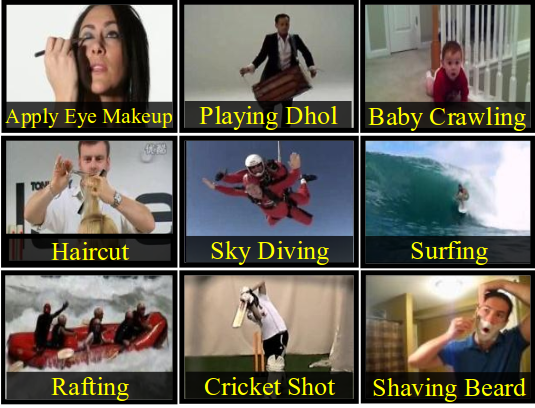

# Action Recognition with Artificial Neural Networks  

This repository contains the code developed to extract and process features from the dataset UCF-101 using DenseTrajectories.  

Having extracted these features, a Neural Network at trajectory-patch level is trained in order to classify the activity that is being executed in the video (i.e: playing a piano, walking, ...). In order to do that, it has been proposed different voting schemes. 

### Prerequisites

	* Extraction performed under a SunGridEngine cluster.
	* Using DenseTrajectories as feature extractor.
	* Training and evaluation performed using [deepnet](https://github.com/nitishsrivastava/deepnet) with [Eigen](http://eigen.tuxfamily.org/index.php?title=Main_Page).

